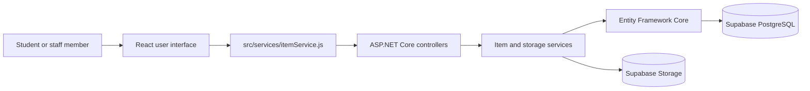

# Campus Link

Campus Link is a full-stack campus lost-and-found noticeboard built for Sri Lankan university communities. Students and staff can publish lost or found item reports, search the shared noticeboard, inspect report details, update information, mark successful returns as resolved, and remove outdated reports.

> SE3090 Assignment 2 Mini Hackathon — Group 22

## Live application

- Web application: [https://sef-mini-hackthon-ai-group22.vercel.app](https://sef-mini-hackthon-ai-group22.vercel.app)
- API: [https://sef-minihackthon-ai-group22.onrender.com/api/items](https://sef-minihackthon-ai-group22.onrender.com/api/items)
- API health check: [https://sef-minihackthon-ai-group22.onrender.com/health](https://sef-minihackthon-ai-group22.onrender.com/health)
- Source repository: [https://github.com/Piumra-Prathiban/SEF_MiniHackthon_AI_Group22](https://github.com/Piumra-Prathiban/SEF_MiniHackthon_AI_Group22)
- Demonstration video: **https://drive.google.com/file/d/1h3AVybETK_1t0f8VQFLKr4jLZb2AW0mf/view?usp=sharing**

## The Sri Lankan problem

Lost-property notices on Sri Lankan university campuses are often scattered between batch WhatsApp groups, paper noticeboards, security desks, and word of mouth. Messages quickly disappear in busy chat histories, paper notices are difficult to search, and students may walk between faculties without knowing whether a found item matches their missing property.

This is a frequent problem involving important belongings such as student identity cards, wallets, phones, calculators, umbrellas, water bottles, notes, and USB drives. The fragmented process wastes time for the person who lost the item, the finder, and university staff.

## Our solution

Campus Link replaces fragmented notices with one searchable, mobile-friendly community noticeboard. It provides a clear workflow:

```text
Create report → Browse/search/filter → View details → Edit → Resolve → Dashboard updates
```

The application keeps lost and found reports structured and current while providing practical safety guidance for verifying ownership and arranging handovers at public campus locations.

## Main features

- Create separate **Lost** and **Found** reports.
- Add item descriptions, campus locations, dates, contact details, and optional images.
- Upload JPEG, PNG, or WebP images to Supabase Storage, or provide an image URL.
- Browse reports ordered newest first.
- Search item names, descriptions, and campus locations.
- Combine report type and resolution-status filters.
- Preserve searches and filters in shareable URL query parameters.
- View complete report information on a dedicated details page.
- Edit existing reports.
- Mark reports as resolved after an item reaches its owner.
- Delete reports with a confirmation step.
- Display live Lost, Found, and Resolved dashboard totals.
- Show recent reports on the landing page.
- Provide interactive lost/found instructions and campus handover safety guidance.
- Display friendly loading, empty, success, validation, and failure states.
- Adapt the layout and navigation for desktop, tablet, and mobile screens.

## Minimum-requirements evidence

| Requirement | Campus Link evidence |
| --- | --- |
| Clear landing page | Responsive dashboard with a hero, calls to action, statistics, recent reports, and an overview of the workflow. |
| Sri Lankan problem explanation | The homepage explains the limitations of campus WhatsApp groups, paper noticeboards, and informal recovery methods. |
| At least two functional features | The application includes report CRUD, search/filtering, resolution tracking, statistics, and image upload. |
| User-input form | The create/edit report form accepts all report details and an optional image. |
| Friendly validation | Field-level React validation is backed by authoritative ASP.NET Core validation. |
| Display/search/filter/update/process | Reports can be displayed, searched, filtered, edited, resolved, deleted, and counted. |
| Responsive interface | CSS breakpoints provide mobile navigation and stacked list, form, details, and dashboard layouts. |
| Basic navigation | Stable routes connect Home, Browse, Details, Report, Edit, and How It Works screens. |
| Relevant sample data | The initial migration seeds six reports based on realistic Sri Lankan campus locations and items. |
| Clear local value | The interface explains the benefits for students, finders, faculty desks, and campus security staff. |

## Technology stack

### Frontend

- React 19
- React Router
- Vite
- JavaScript and CSS
- Lucide React icons
- Oxlint
- Vercel hosting

### Backend

- ASP.NET Core 8 Web API
- Entity Framework Core 8
- Npgsql PostgreSQL provider
- Swagger/OpenAPI in Development
- xUnit and EF Core InMemory for tests
- Docker deployment on Render

### Data and storage

- Supabase PostgreSQL
- Supabase Storage for report images
- Entity Framework Core migrations

## Architecture



The project follows this dependency direction:

```text
React UI → itemService.js → /api endpoints → controllers → services → EF Core → PostgreSQL
```

- Pages coordinate route state and server requests.
- Reusable components render forms, cards, layout, and loading states.
- `itemService.js` is the single frontend API boundary.
- Controllers handle HTTP behavior and delegate application logic.
- Services perform queries, CRUD operations, DTO mapping, and storage integration.
- DTOs define the public API without exposing EF Core entities.

## Repository structure

```text
SEF_MiniHackthon_AI_Group22/
├── backend/
│   ├── MiniHackthonSEF.Api/
│   │   ├── Controllers/
│   │   ├── Data/
│   │   │   └── Migrations/
│   │   ├── DTOs/
│   │   ├── Models/
│   │   ├── Services/
│   │   ├── Dockerfile
│   │   └── Program.cs
│   └── MiniHackthonSEF.Api.Tests/
├── frontend/
│   └── sef-hackathon/
│       ├── public/
│       └── src/
│           ├── assets/
│           ├── components/
│           ├── pages/
│           ├── services/
│           └── utils/
├── compose.yaml
├── render.yaml
└── README.md
```

## Application routes

| Route | Screen |
| --- | --- |
| `/` | Dashboard and recent reports |
| `/items` | Searchable and filterable report list |
| `/items/:id` | Report details and resolve/delete actions |
| `/report` | Create a report |
| `/items/:id/edit` | Edit an existing report |
| `/how-it-works` | Interactive workflow and safety guide |

## API reference

Base route: `/api/items`

| Method | Route | Purpose | Success response |
| --- | --- | --- | --- |
| `GET` | `/api/items` | List reports newest first | `200 OK` |
| `GET` | `/api/items/{id}` | Get one report | `200 OK` |
| `POST` | `/api/items` | Create a report | `201 Created` |
| `PUT` | `/api/items/{id}` | Update editable report fields | `200 OK` |
| `PATCH` | `/api/items/{id}/resolve` | Mark a report resolved | `200 OK` |
| `DELETE` | `/api/items/{id}` | Delete a report | `204 No Content` |
| `POST` | `/api/images` | Upload an image | `201 Created` |
| `GET` | `/health` | Check API availability | `200 OK` |

The list endpoint supports these optional filters:

| Query parameter | Accepted value |
| --- | --- |
| `search` | Partial text matched case-insensitively against name, description, and location |
| `type` | `Lost` or `Found` |
| `resolved` | `true` or `false` |

Filters use AND semantics. Example:

```http
GET /api/items?search=calculator&type=Lost&resolved=false
```

Create/update request example:

```json
{
  "name": "Black wallet",
  "description": "Small leather wallet with a student ID inside",
  "type": "Lost",
  "location": "Main Library, Ground Floor",
  "date": "2026-09-04",
  "contactInfo": "student@example.edu",
  "imageUrl": "https://example.com/wallet.jpg"
}
```

`id`, `isResolved`, `createdAt`, and `updatedAt` are managed by the server and must not be sent through create or update requests.

## Getting started

### Prerequisites

- Git
- [.NET SDK 8](https://dotnet.microsoft.com/download/dotnet/8.0)
- Node.js 20.19 or newer
- npm
- PostgreSQL 16, a Supabase project, or Docker with Docker Compose

Clone the repository:

```sh
git clone https://github.com/Piumra-Prathiban/SEF_MiniHackthon_AI_Group22.git
cd SEF_MiniHackthon_AI_Group22
```

### Option A: local PostgreSQL with Docker

Start PostgreSQL from the repository root:

```sh
docker compose up -d postgres
```

The development connection string already targets the Docker database:

```text
Host=localhost;Port=5432;Database=campus_lost_found;Username=postgres;Password=postgres
```

This credential is for the disposable local development database only. Never reuse it for a public database.

Restore the pinned EF Core tool and apply migrations:

```sh
cd backend/MiniHackthonSEF.Api
dotnet tool restore
dotnet tool run dotnet-ef database update
```

Start the API:

```sh
dotnet run --launch-profile http
```

The local API runs at `http://localhost:5062`. Swagger is available in Development at `http://localhost:5062/swagger`.

In a second terminal, start the frontend:

```sh
cd frontend/sef-hackathon
cp .env.example .env.local
npm ci
npm run dev
```

Open `http://localhost:5173`. A blank `VITE_API_BASE_URL` uses the Vite `/api` proxy configured for `http://localhost:5062`.

To stop the local database later:

```sh
docker compose stop postgres
```

### Option B: Supabase PostgreSQL

Create a Supabase project and copy its transaction/session pooler connection information from **Project Settings → Database**. Store credentials in .NET user-secrets instead of committing them:

```sh
cd backend/MiniHackthonSEF.Api
dotnet user-secrets set "ConnectionStrings:DefaultConnection" "Host=YOUR_POOLER_HOST;Port=5432;Database=postgres;Username=postgres.YOUR_PROJECT_REF;Password=YOUR_PASSWORD;SSL Mode=Require"
```

If image uploads are required, create a **public** Supabase Storage bucket named `item-images`, then configure the server-side storage values:

```sh
dotnet user-secrets set "Supabase:Url" "https://YOUR_PROJECT_REF.supabase.co"
dotnet user-secrets set "Supabase:StorageBucket" "item-images"
dotnet user-secrets set "Supabase:SecretKey" "YOUR_SERVER_SIDE_SUPABASE_SECRET_KEY"
```

Never expose the database password or Supabase secret key through a `VITE_` variable. Vite variables are included in browser JavaScript.

Apply the committed migration to Supabase:

```sh
dotnet tool restore
dotnet tool run dotnet-ef database update
```

Then start the backend and frontend using the same commands shown in Option A.

### Running without the Vite proxy

Set `frontend/sef-hackathon/.env.local` when the backend uses a different origin:

```dotenv
VITE_API_BASE_URL=http://localhost:5062
```

Restart Vite after changing an environment variable.

## Configuration reference

### Backend

ASP.NET Core maps double underscores in environment-variable names to configuration sections.

| Variable | Required | Purpose |
| --- | --- | --- |
| `ConnectionStrings__DefaultConnection` | Production | PostgreSQL/Supabase connection string |
| `ASPNETCORE_ENVIRONMENT` | Recommended | Use `Development` locally and `Production` when deployed |
| `Cors__AllowedOrigins__0` | Production | Exact permitted frontend origin |
| `Supabase__Url` | For uploads | Supabase project URL |
| `Supabase__SecretKey` | For uploads | Server-side Supabase key; keep secret |
| `Supabase__StorageBucket` | Optional | Storage bucket; defaults to `item-images` |

Additional allowed CORS origins can use `Cors__AllowedOrigins__1`, `Cors__AllowedOrigins__2`, and so on.

### Frontend

| Variable | Required | Purpose |
| --- | --- | --- |
| `VITE_API_BASE_URL` | Optional | API origin for a separately hosted backend; leave blank for the local proxy or Vercel rewrite |

Only put public configuration in variables beginning with `VITE_`.

## Database migrations and sample data

The committed `InitialCreate` migration creates the `ItemReports` table, indexes report timestamps and status fields, and inserts six sample reports:

- Black leather wallet — Main Library
- Blue water bottle — Faculty of Computing Lab 2
- Student ID card — University Cafeteria
- Casio scientific calculator — Engineering Lecture Hall B
- Red umbrella — Arts Building
- USB flash drive — IT Centre

Create a migration after an intentional schema change:

```sh
cd backend/MiniHackthonSEF.Api
dotnet tool run dotnet-ef migrations add DescriptiveMigrationName --output-dir Data/Migrations
dotnet tool run dotnet-ef database update
```

Commit migration source files, but do not commit `bin`, `obj`, database passwords, or local environment files.

## Validation and error handling

Important rules are checked in both the browser and API:

- Name: 2–100 trimmed characters
- Description: 5–1,000 trimmed characters
- Location: 2–150 trimmed characters
- Date: required and cannot be in the future
- Contact details: 3–200 trimmed characters
- Type: `Lost` or `Found`
- Image URL: absolute `http` or `https` URL when supplied
- Uploaded image: JPEG, PNG, or WebP with a maximum size of 5 MB

The UI provides field-level messages and disables submission while saving. API validation remains authoritative and returns ASP.NET Core validation problem details. Unexpected implementation details and stack traces are not displayed to users.

## Running checks

Frontend:

```sh
cd frontend/sef-hackathon
npm ci
npm run lint
npm run build
```

Backend:

```sh
cd backend/MiniHackthonSEF.Api
dotnet restore
dotnet build

cd ../MiniHackthonSEF.Api.Tests
dotnet test
```

The current backend test suite covers combined filters, trimming and server-managed fields, idempotent resolution, missing records, invalid dates and image URLs, and malformed query filters.

Useful live checks:

```sh
curl https://sef-minihackthon-ai-group22.onrender.com/health
curl "https://sef-minihackthon-ai-group22.onrender.com/api/items?type=Found&resolved=false"
```

## Manual end-to-end verification

Before presenting or submitting, test the deployed revision in a private/incognito browser:

1. Confirm the landing page explains the Sri Lankan campus problem.
2. Create one Lost report and one Found report.
3. Upload an image and confirm it appears in the new report.
4. Search by an item keyword and a campus location.
5. Combine the type and resolution-status filters.
6. Open a report and confirm its full details appear.
7. Edit the report and verify the changes on the list and details pages.
8. Mark the report resolved and confirm the dashboard count changes.
9. Delete the test report and confirm it disappears.
10. Repeat the main flow at desktop and narrow mobile widths.
11. Open every submission link without relying on a signed-in browser session.

## Deployment

### Backend on Render

The root `render.yaml` deploys the ASP.NET Core API from its Dockerfile.

1. Create a Render Web Service or Blueprint from this repository.
2. Use the repository root so Render can read `render.yaml`.
3. Add these secret environment variables:
   - `ConnectionStrings__DefaultConnection`
   - `Supabase__SecretKey` when image upload is enabled
4. Confirm `Cors__AllowedOrigins__0` exactly matches the production Vercel URL.
5. Deploy and check `/health` before connecting the frontend.
6. Apply EF Core migrations to the Supabase database from a trusted development machine or deployment job.

### Frontend on Vercel

Use these project settings:

| Setting | Value |
| --- | --- |
| Root directory | `frontend/sef-hackathon` |
| Framework preset | Vite |
| Install command | `npm ci` |
| Build command | `npm run build` |
| Output directory | `dist` |

`vercel.json` provides SPA route fallback and proxies `/api/*` upload requests to Render. Redeploy after changing Vercel variables or `vercel.json`.

## Troubleshooting

### `nodename nor servname provided, or not known`

The PostgreSQL hostname is malformed, still contains a placeholder, or cannot be resolved. Copy the pooler host exactly from Supabase and verify that the username includes the project reference when required.

### Local frontend cannot load reports

- Confirm the API is running at `http://localhost:5062`.
- Confirm the frontend is running through Vite at `http://localhost:5173`.
- Restart Vite after changing `.env.local`.
- Visit `http://localhost:5062/health` directly.

### Deployed frontend cannot load reports

- Visit the Render `/health` and `/api/items` URLs directly.
- Confirm the frontend uses an HTTPS API endpoint.
- Check that the exact Vercel origin is in the Render CORS configuration.
- Redeploy both services after changing environment variables.
- A free Render service may need time to wake after inactivity.

### Image upload service is unavailable

- Confirm the public `item-images` bucket exists in Supabase Storage.
- Confirm `Supabase__SecretKey` is set on Render.
- Confirm `Supabase:Url` and the bucket name refer to the same Supabase project.
- Confirm Vercel deployed the `/api/:path*` rewrite from `vercel.json`.
- Inspect Render logs for the storage response status without exposing the secret key.

## Security notes

- Never commit PostgreSQL passwords, Supabase secret/service-role keys, or populated `.env` files.
- Rotate a secret immediately if it is accidentally shared publicly or committed.
- Keep the Supabase secret key on the backend only.
- Do not expose private identifying details in report photos or descriptions.
- Verify ownership using information omitted from the public report.
- Arrange returns at monitored, public campus locations.
- Authentication is outside this hackathon MVP, so the deployment should be treated as a demonstration system rather than a production property-management platform.

## Team members and contributions

Each member must replace the placeholders below with their own accurate contribution statement in their own words. Do not describe work a member cannot explain during the demonstration.

| Team member | Student ID | Contribution written by the member |
| --- | --- | --- |
| **TODO — Member 1 name** | **TODO — ID** | **TODO — describe report-management code and other verified work** |
| **TODO — Member 2 name** | **TODO — ID** | **TODO — describe browse/details code and other verified work** |
| **TODO — Member 3 name** | **TODO — ID** | **TODO — describe dashboard/resolution code and other verified work** |

## AI usage declaration

The team used **OpenAI Codex** as a development assistant for interface refinement, full-stack implementation support, deployment troubleshooting, configuration guidance, code review, verification planning, and README preparation. Team members reviewed the generated suggestions, modified them where needed, ran the application, checked the deployed services, and remain responsible for understanding and presenting the submitted work.

No AI-generated output should be accepted solely because it was generated. The checked-in implementation must be understood and verified by the team.

## AI prompt log

The following entries capture significant prompts from the development session. The team should confirm the review notes, add any prompts used in separate tools or chats, redact secrets and personal data, and copy the final table into the submission PDF.

| Tool | Exact prompt, with secrets/personal data redacted | Purpose | Review or modification performed |
| --- | --- | --- | --- |
| OpenAI Codex | `okay now take a look and make a good frontend for this` | Replace the starter interface with a usable Campus Link frontend. | Reviewed routes, responsive layout, accessibility labels, build output, and browser rendering. |
| OpenAI Codex | `okay now lets create the back end for the system, and wire it up with the frontend` | Implement the ASP.NET Core API and connect the React service layer. | Checked the API contract, DTO mapping, CRUD flow, frontend loading/error states, and builds. |
| OpenAI Codex | `okay now lets work on conecting the prostgress, save those data to a env file` | Configure PostgreSQL without committing credentials. | Used configuration/user-secret patterns, checked ignored environment files, and applied EF migrations. |
| OpenAI Codex | `i want to create the postgress with the supabase` | Use Supabase PostgreSQL for the hosted database. | Verified the pooler connection format, SSL requirement, migration output, and live API data. |
| OpenAI Codex | `postgresql://postgres.[PROJECT-REF]:[REDACTED]@[SUPABASE-POOLER]:5432/postgres` | Diagnose and configure the Supabase connection string. | Redacted credentials, converted the value to the backend configuration format, and verified database connectivity. |
| OpenAI Codex | `okay how to make it run on the local build too` | Support local frontend/backend development alongside Supabase. | Confirmed launch profiles, local ports, Vite proxy behavior, and local execution commands. |
| OpenAI Codex | `how to make it work on my other team members` | Document reproducible teammate setup without sharing secrets. | Separated committed configuration from per-user secrets and documented migration/setup steps. |
| OpenAI Codex | `btw only the links are supported for images i want to implement a way to add images too, how to do it` | Add direct image uploads. | Added client file validation, backend signature/size validation, Supabase Storage integration, and deployment configuration checks. |
| OpenAI Codex | `The image upload service is unavailable. gives this error` | Diagnose the deployed image upload path. | Checked frontend request routing, Vercel rewrites, Render configuration, and Supabase Storage requirements. |
| OpenAI Codex | `i want to get items via bruno what is the sampl get request to get items` | Test the API independently of the frontend. | Verified the list URL, request method, optional filters, and JSON response. |
| OpenAI Codex | `can you revamp the home page image in a good way, it looks un even, can you revampo the homepage for a bit` | Improve the landing-page hero composition. | Reframed the panoramic image, added responsive crops and readable overlays, then ran lint/build and desktop/mobile screenshot checks. |
| OpenAI Codex | `1.3 Minimum software requirements ... see if all this checks` | Audit the application against all ten assignment requirements. | Inspected frontend/backend evidence, ran the production build and five backend tests, and checked the live frontend, API, filters, database data, and CORS. |
| OpenAI Codex | `amaze amaze amaze, what i need now is a comphrehensive readme md file to commit` | Prepare complete repository and submission documentation. | Cross-checked commands, routes, variables, deployment configuration, tests, and placeholders against the repository. |

## Demonstration plan (maximum two minutes)

Suggested recording sequence:

1. **0:00–0:15 — Introduction:** group, product name, and the Sri Lankan campus problem.
2. **0:15–0:30 — Solution:** explain the shared searchable noticeboard and intended users.
3. **0:30–0:55 — Create:** submit a Lost or Found report with validation and an image.
4. **0:55–1:15 — Discover:** search and combine type/status filters.
5. **1:15–1:35 — Manage:** open details, edit the report, and mark it resolved.
6. **1:35–1:50 — Impact:** show updated dashboard totals and the Sri Lankan user-value section.
7. **1:50–2:00 — Close:** show the live URL and summarize the expected benefit.

## Final submission checklist

- [ ] Replace every `TODO` in this README.
- [ ] Confirm every member’s name and student ID.
- [ ] Have every member write and approve their own contribution statement.
- [ ] Add the accessible demonstration video link.
- [ ] Confirm the Git repository is public or shared with the assessors.
- [ ] Test the Vercel application in an incognito browser.
- [ ] Confirm the Render health endpoint and API return successfully.
- [ ] Complete the create/search/edit/resolve/delete demonstration flow.
- [ ] Confirm the layout works on a narrow mobile viewport.
- [ ] Add any missing AI interactions to the prompt log.
- [ ] Copy the final AI prompt log into the submission PDF.
- [ ] Include repository, deployment, and video links in the PDF.
- [ ] Rename the PDF using the required Group ID.
- [ ] Verify all shared links without relying on a signed-in session.

## License

This repository was created for the SE3090 Assignment 2 Mini Hackathon. No separate open-source license has been declared.
